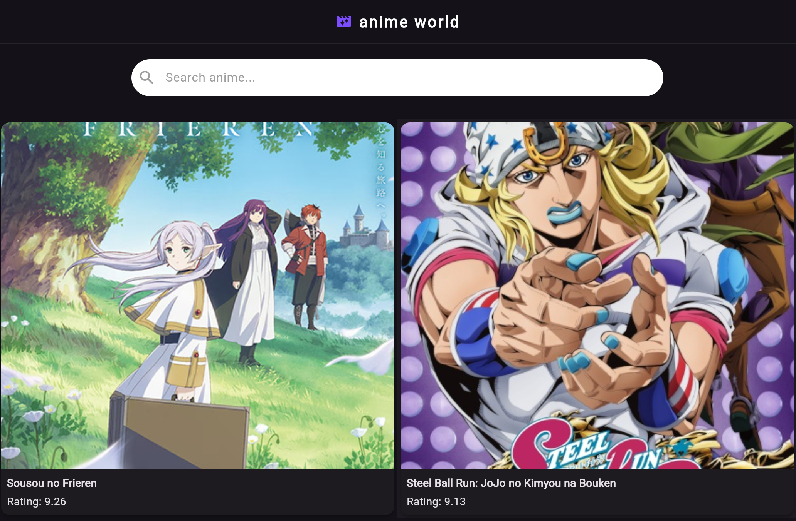
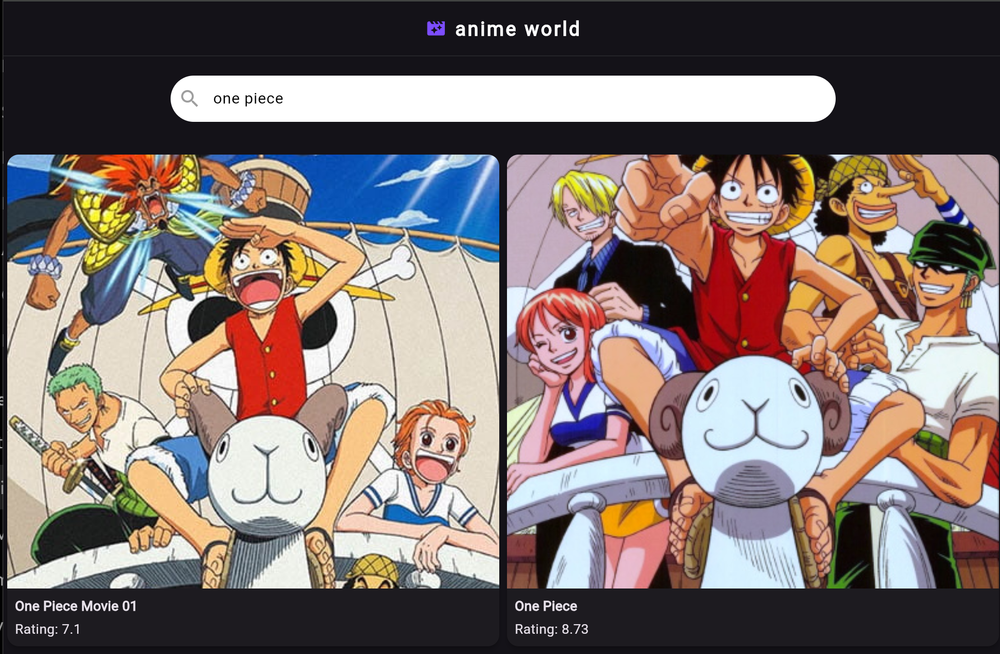

# Flutter Anime App

A Flutter application built using the Jikan Anime API that allows users to browse top anime, search anime by title, and view detailed anime information.

## Features

- Top Anime Listing
- Infinite Scroll Pagination
- Anime Search
- Anime Details Screen
- Riverpod State Management
- Repository Pattern
- Clean Folder Structure

## Tech Stack

- Flutter
- Dart
- Riverpod
- HTTP
- Jikan API

## Screenshots

## Folder Structure

text
lib/
│
├── models/
├── providers/
├── repository/
├── screens/
├── widgets/
└── main.dart

## Architecture

The project follows a simple and scalable architecture using:

- Repository Pattern
- AsyncNotifierProvider
- FutureProvider.family
- StateProvider

## Learning Outcomes

Through this project, I practiced:

- API Integration
- Pagination
- Riverpod State Management
- Search Architecture
- Navigation
- Async Programming
- Clean Code Organization

## API Used

Jikan API

https://api.jikan.moe/

## Future Improvements

- Favorites Feature
- Offline Caching
- Better Animations
- Search Suggestions
- Theme Switching

## Author

Yug Patel

Computer Science Student | Flutter Developer
